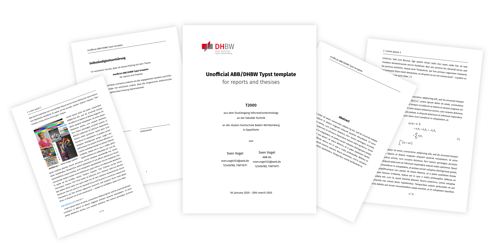

<div align="center">
    <h1>DHBW-ABB template for Typst</h1>
    
    
    
    
    
    
    <br>
    <br>
    <b>Unofficial</b> but feature rich Typst template for writing a thesis or report at DHBW<br>
    with according ABB AG branding in mind.
    <br>
    <br>
    
</div>

## Table of Contents

1. [Contribution](#contribution)
1. [Features](#features)
2. [Usage](#usage)
2. [Preview of pages](#preview)
3. [Relation to DHBW docx template](#dhbw-docx-template)
4. [Format and branding conformance](#format)
5. [Fonts](#fonts)
6. [Legal](#legal)
7. [For LaTeX users](#for-users-jumping-over-from-latex)
8. [FAQ](#faq)
    1. [Typst vs LaTeX](#why-typst-instead-of-latex)
    2. [Source of logos](#where-are-the-logos-from)

## Contribution

> ⚠️ **Important** <br>
> Development happens at an external site [here](https://git.montehaselino.de/DHBW/dhbw-abb-typst-template).
> The GitHub repository is only a push mirror, but issues are still welcome at any time!

## Features

> ⚠️ **Notice** <br>
> Typst ist under active development and thus may lack features an experienced LaTeX is used to.

This template includes designs for a titlepage, confidantiality statement, declaration of authorship and more with a consistent design inspired by various unofficial works made by students at DHBW. Layout and the choise fonts are based on the unofficial [supercharged-dhbw](https://github.com/DannySeidel/typst-dhbw-template) Typst template. It comes with automatic generation of outlines for figures, tables, code snippets and appendices.
The template can generate sections for a glossary, combinging acronyms and technical terms into a singular section.

A short overview of all features the template is capable of:
- Acronyms
- Glossary
- Table of Contents for: headings, figures, tables and listings and appendecis
- Appendix
- Extra page for:
    - Declaration of Authorship
    - Confidentiality Statement
    - Preleminary notice
- Watermark for draft versions
- Automatic form filling for data provided via configuration
- Styles for captions, tables and equations
- ABB branding inspired code theme

## Preview


## Usage

### Without Typst package manager

Clone the repository into a subfolder of your project or add it a git submodule. The you can import the `lib.typ` file from `src`.
Once thats done calling the following snippet `#show: dhbw-template.with(conf)` will setup the template. You can provide a configuration for the template to use.
The default configuration can be found in `src/conf.typ`.

```typst
#import "src/lib.typ": *

#show: dhbw-template.with((
  // language settings used to make decisions about hyphenation and others
  lang: "en",       // ISO 3166 language code of text: "de", "en"
  region: "en",     // region code
  // mark this thesis as draft
  // Adds preleminarry note page and watermark
  draft: true,
  // information about author(s)
  university: (
    program: "Informationtechnology",
    faculty: "Technik",
    name: "dualen Hochschule Baden-Württemberg",
    campus: "Eppelheim"
  ),
  authors: (
    (
      name: "Sven Vogel",
      course: "TINF19IT1",
      company: "ABB AG",
      supervisor: "Benny Goodman",
      matriculation-number: 123456789
    ),
    (
      name: "Kurt Jammer",
      course: "TINF24AI2",
      company: "Siemens",
      supervisor: "Henry Badman",
      matriculation-number: 478568763
    ),
  ),
  // information about thesis
  thesis: (
    title: "Unofficial ABB/DHBW Typst template",
    subtitle: "for reports and thesises",            // subtitle may be none
    submission-date: "23rd march 2020",
    timeframe: "1st january 2020 - 20th march 2020",
    kind: "T2000",
    // translated version of abstract, only used in case language is not english
    summary: none,
    abstract: none,
    preface: none,
    keywords: ( "IT", "other stuff" ),
    bibliography: none /* bibliography("refs.bib") */,
    glossary: none,
    appendices: none),
  style: (
    header: (
      content-padding: 1.5em,
      underline-top-padding: 0pt,
      logo-height: 5em,
      logo-image: "res/ABB.svg"),
    footer: (
      content-padding: 1.5em),
    page: (
      format: "a4",
      margin: (
        left: 3cm,
        right: 2.5cm,
        top: 2.5cm,
        bottom: 2.5cm)),
    text: (
      size: 12pt,
      font: "Fira Sans"),
    heading: (
    font: "Fira Sans"),
    code: (
      theme: "res/abb.tmTheme",
      font: "FiraCode Nerd Font",
      lines: false,
      size: 10pt,
      tab-size: 4),
    link: (
      color: ABB-GRAY-02)))

// Your document code goes here!

= Introduction

lorem(50)

= Chapter 1

#lorem(230)

```

## DHBW DOCX template

The official [DHBW template for Word](https://blog.fakultaet-technik.de/wp-content/uploads/2015/06/Studienarbeitsvorlage.docx) was used a strong inspiration but not as base template.

## Format
All pages have a margin of 2.5cm between header/footer/content and the page border.
Header and footer do not overlap into this margin in order to conform to university requirements.

Bibliography is formated with the IEEE style. <br>
Appendecies make use of an abbreviation of APA style.

Complies with ABB branding guidelines such as:
- proper usage of the logo
- respecting the logo safe area
- brand colors (in syntax highlightning)

## Fonts

Both fonts used in the document are licensed under the [Open Font License](https://openfontlicense.org/) and can be used for non-commercial as well as commercial purposes:
- [Fira Sans](https://github.com/bBoxType/FiraSans)
- [Fira Math](https://github.com/firamath/firamath)
- [Fira Code NF](https://www.nerdfonts.com/font-downloads)

Consider giving the creators of the font credit for their amazing work!

## For users jumping over from LaTeX

The developers around Typst have made pretty handy comparison guide between LaTeX and Typst syntax and features. You can find it [here](https://typst.app/docs/guides/guide-for-latex-users/).

## Legal

This template and its content is in no way officially affiliaterd with either DHBW or ABB AG.
Its only purpose is to simplify the process of getting started with the typsetting language Typst for writing a university report or thesis.
As author and owner of the reposity I claim no copyright of the logos used in the document, the software used to compile the source or the documents based on this template.

## FAQ

### Why Typst instead of LaTeX?

LaTeX is quite old. Which does not make it bad just because. But with its age and historically grown way of dealing with pretty much any kind of task - has made LaTeX cumbersome to work with. The syntax is outdated for sure but the most annoying issues (for me personally) are the following:
- long compilation times
- poor documentation of build systems such as `latexmk`
- lots of stuff requires extra programs to be run in between
- page layout is easy to mess up
- HUGE installation size

Typst in comparison is serval orders of magnitudes faster and has native support for UTF-8. It automatically runs several times to generate the proper layout and links. Additionally being open source and written in Rust it is contained within a single handy binary.

**TLDR;** I find Typst easier and faster to work with.

### Where are the logos from?

The logos for both ABB AG and DHBW are freely available at Wikimedia Commons:
- [ABB logo as svg](https://commons.wikimedia.org/wiki/File:ABB_logo.svg)
- [DHBW logo as svg](https://upload.wikimedia.org/wikipedia/de/1/1d/DHBW-Logo.svg)
